<!-- Akai (赤) Anime profile. Every SVG in assets/ is generated by tools/build_assets.py and tools/lab.py: all type is vector paths, so it renders the same on every OS. This file is written by tools/build_readme.py. -->

<picture><source media="(prefers-color-scheme: dark)" srcset="assets/hero.svg"><source media="(prefers-color-scheme: light)" srcset="assets/hero-light.svg"></picture>
<picture><source media="(prefers-color-scheme: dark)" srcset="assets/ribbon-status.svg"><source media="(prefers-color-scheme: light)" srcset="assets/ribbon-status-light.svg"></picture>

PROLOGUE · 第零話

Final years of Software Engineering at KBTU, Almaty. Three years of building Python backends that ship: Django and FastAPI services, PostgreSQL schemas, Telegram bots, browser and API automation, computer vision on OpenCV, and the Angular or React fronts that sit on top of them. In 2026 that meant a pairing engine for Efes Kazakhstan with 412 drinks in it, an AI scoring pipeline for inDrive at Decentrathon 5.0, a Telegram analytics SaaS in private beta with 703 tests behind it, and three more builds in the lab. The old bio said <code>pythoooooooooon</code>. Still accurate.

<picture><source media="(prefers-color-scheme: dark)" srcset="assets/chapter-01.svg"><source media="(prefers-color-scheme: light)" srcset="assets/chapter-01-light.svg"></picture>

<picture><source media="(prefers-color-scheme: dark)" srcset="assets/sheet.svg"><source media="(prefers-color-scheme: light)" srcset="assets/sheet-light.svg"></picture>

 

<picture><source media="(prefers-color-scheme: dark)" srcset="assets/chapter-02.svg"><source media="(prefers-color-scheme: light)" srcset="assets/chapter-02-light.svg"></picture>

<a href="https://efesccl-champ.vercel.app">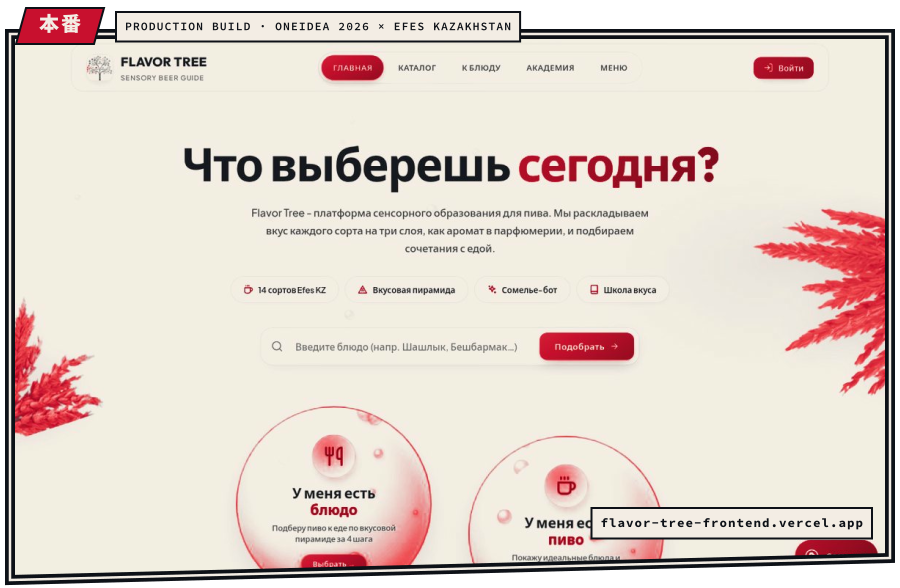</a>
<a href="https://efes-ccl.vercel.app">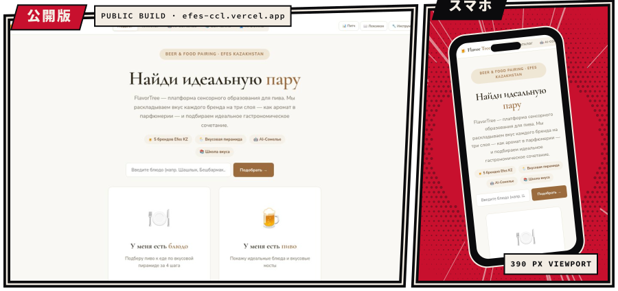</a>

<picture><source media="(prefers-color-scheme: dark)" srcset="assets/flavor-stats.svg"><source media="(prefers-color-scheme: light)" srcset="assets/flavor-stats-light.svg">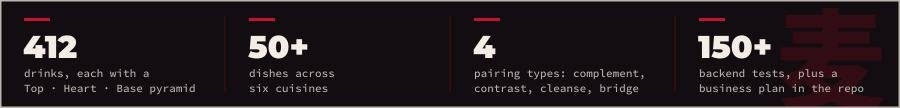</picture>

Sensory beer education for Efes Kazakhstan, built for OneIdea Championship 2026. Every drink is decomposed into a Top / Heart / Base flavor pyramid, the way a perfumer reads a scent. The pairing engine is explainable by design: each match returns a score, its type (complement, contrast, cleanse or bridge), three reasons in plain language, a serving temperature and a glass. Venues get QR menus, guests get an AI sommelier on Claude. Angular 18 on the front, Django REST and PostgreSQL behind it, 150+ backend tests, business plan and Lean Canvas in the repo, deployed on Vercel and Railway.

<a href="https://efes-ccl.vercel.app"><picture><source media="(prefers-color-scheme: dark)" srcset="assets/btn-live.svg"><source media="(prefers-color-scheme: light)" srcset="assets/btn-live-light.svg"></picture></a>
<a href="https://github.com/overloooooord/efesccl-champ"><picture><source media="(prefers-color-scheme: dark)" srcset="assets/btn-devrepo.svg"><source media="(prefers-color-scheme: light)" srcset="assets/btn-devrepo-light.svg"></picture></a>
<a href="https://github.com/Adelllya/Efes-ccl-Flavor"><picture><source media="(prefers-color-scheme: dark)" srcset="assets/btn-teamrepo.svg"><source media="(prefers-color-scheme: light)" srcset="assets/btn-teamrepo-light.svg"></picture></a>

 

<picture><source media="(prefers-color-scheme: dark)" srcset="assets/chapter-03.svg"><source media="(prefers-color-scheme: light)" srcset="assets/chapter-03-light.svg"></picture>

<picture><source media="(prefers-color-scheme: dark)" srcset="assets/quest-smm.svg"><source media="(prefers-color-scheme: light)" srcset="assets/quest-smm-light.svg"></picture>

<a href="https://github.com/overloooooord/indrive"><picture><source media="(prefers-color-scheme: dark)" srcset="assets/quest-invision.svg"><source media="(prefers-color-scheme: light)" srcset="assets/quest-invision-light.svg">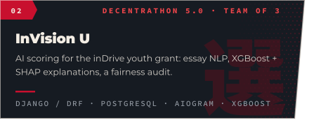</picture></a><picture><source media="(prefers-color-scheme: dark)" srcset="assets/quest-igtg.svg"><source media="(prefers-color-scheme: light)" srcset="assets/quest-igtg-light.svg">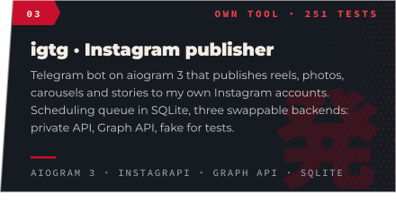</picture>

InVision U was a team of three (with Ilyas Aitkhozha and Denis): 186 commits, 49 mine. The latest commit dropped the backend from the tree, so the full source with backend and ML lives at <a href="https://github.com/overloooooord/indrive/tree/3c30480">3c30480</a>. SMM Radar is my own product and has no public repo yet. Scores in InVision U track a candidate's growth trajectory, not a snapshot of grades.

 

<picture><source media="(prefers-color-scheme: dark)" srcset="assets/chapter-04.svg"><source media="(prefers-color-scheme: light)" srcset="assets/chapter-04-light.svg"></picture>

<picture><source media="(prefers-color-scheme: dark)" srcset="assets/automation.svg"><source media="(prefers-color-scheme: light)" srcset="assets/automation-light.svg"></picture>

<picture><source media="(prefers-color-scheme: dark)" srcset="assets/ops.svg"><source media="(prefers-color-scheme: light)" srcset="assets/ops-light.svg">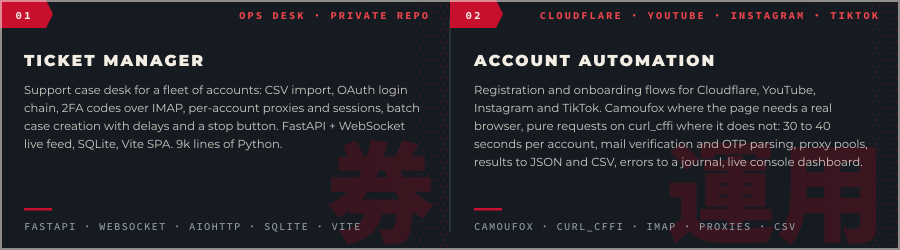</picture>

Three years of this before the products: pipelines that log in, verify, collect and report on their own, with a dashboard to watch them and a Telegram bot to steer them. Repos with client accounts and credentials stay private.

 

<picture><source media="(prefers-color-scheme: dark)" srcset="assets/chapter-05.svg"><source media="(prefers-color-scheme: light)" srcset="assets/chapter-05-light.svg">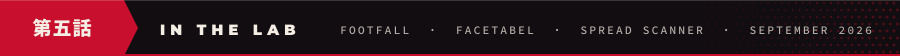</picture>

<picture><source media="(prefers-color-scheme: dark)" srcset="assets/lab.svg"><source media="(prefers-color-scheme: light)" srcset="assets/lab-light.svg">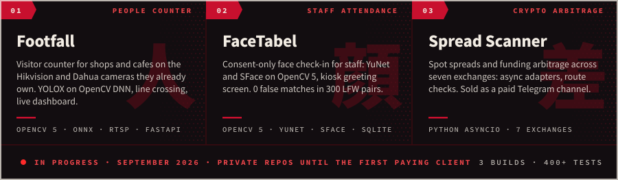</picture>

 

<picture><source media="(prefers-color-scheme: dark)" srcset="assets/chapter-06.svg"><source media="(prefers-color-scheme: light)" srcset="assets/chapter-06-light.svg"></picture>

<picture><source media="(prefers-color-scheme: dark)" srcset="assets/clients.svg"><source media="(prefers-color-scheme: light)" srcset="assets/clients-light.svg">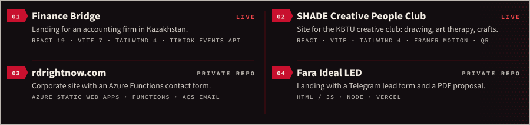</picture>

Finance Bridge: <a href="https://finance-bridge-one.vercel.app">live</a> · <a href="https://github.com/Adelllya/Finance_Bridge">source</a>. SHADE: <a href="https://shade-web-five.vercel.app">live</a>. Two front ends with public links; the rest of the client work sits in private repos.

 

<picture><source media="(prefers-color-scheme: dark)" srcset="assets/chapter-07.svg"><source media="(prefers-color-scheme: light)" srcset="assets/chapter-07-light.svg"></picture>

<picture><source media="(prefers-color-scheme: dark)" srcset="assets/contrib-log.svg"><source media="(prefers-color-scheme: light)" srcset="assets/contrib-log-light.svg">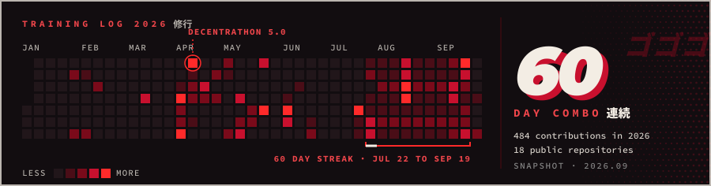</picture>

<picture><source media="(prefers-color-scheme: dark)" srcset="https://raw.githubusercontent.com/overloooooord/overloooooord/output/github-snake-dark.svg"><source media="(prefers-color-scheme: light)" srcset="https://raw.githubusercontent.com/overloooooord/overloooooord/output/github-snake.svg"></picture>

 

<picture><source media="(prefers-color-scheme: dark)" srcset="assets/chapter-next.svg"><source media="(prefers-color-scheme: light)" srcset="assets/chapter-next-light.svg"></picture>

<picture><source media="(prefers-color-scheme: dark)" srcset="assets/next-episode.svg"><source media="(prefers-color-scheme: light)" srcset="assets/next-episode-light.svg">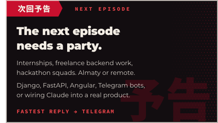</picture>

<a href="https://t.me/dreamdrainer"><picture><source media="(prefers-color-scheme: dark)" srcset="assets/btn-telegram.svg"><source media="(prefers-color-scheme: light)" srcset="assets/btn-telegram-light.svg"></picture></a>
<a href="https://www.instagram.com/_abutalifuly_/"><picture><source media="(prefers-color-scheme: dark)" srcset="assets/btn-instagram.svg"><source media="(prefers-color-scheme: light)" srcset="assets/btn-instagram-light.svg"></picture></a>
<a href="https://www.tiktok.com/@machiavellistt"><picture><source media="(prefers-color-scheme: dark)" srcset="assets/btn-tiktok.svg"><source media="(prefers-color-scheme: light)" srcset="assets/btn-tiktok-light.svg"></picture></a>

<picture><source media="(prefers-color-scheme: dark)" srcset="assets/footer.svg"><source media="(prefers-color-scheme: light)" srcset="assets/footer-light.svg"></picture>

